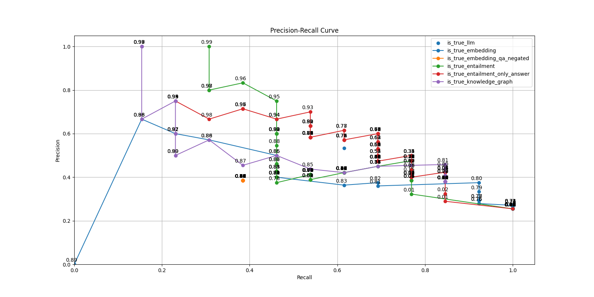

# veryLLM

[Try the veryLLM app](https://veryLLM.vercel.app/)

## Run veryLLM Locally

### Start veryLLM Is True Server

1.  Open a New Terminal
2.  `python3 -m venv venv`
3.  `source venv/bin/activate`
4.  `pip3 install -r requirements.txt`
5.  `python3 app.py`

## Leaderboard

<!-- LEADERBOARD_START -->

| Function                       | Description                                                                                                       | Author | F1 Score |
| :----------------------------- | :---------------------------------------------------------------------------------------------------------------- | :----- | -------: |
| validator_all_v1               | All prediction functions combined (excluding ones marked as ignore)                                               | Team   | 0.695652 |
| is_true_entailment_only_answer | Uses the entailment model to predict whether the answer is true or false. Only uses the answer as the hypothesis. | Andrew | 0.642857 |
| validator_all_v0               | All prediction functions combined (excluding ones marked as ignore)                                               | Team   | 0.642857 |
| is_true_knowledge_graph        | Uses the knowledge graph to predict whether the answer is true or false.                                          | Andrew | 0.594595 |
| is_true_entailment             | Uses the entailment model to predict whether the answer is true or false.                                         | Andrew | 0.588235 |
| is_true_llm                    | Uses the LLM to predict whether the answer is true or false.                                                      | Andrew | 0.571429 |
| is_true_embedding              | Uses the embedding similarity to predict whether the answer is true or false.                                     | Kevin  | 0.533333 |
| is_true_embedding_qa_negated   | Uses the embedding similarity to predict whether the answer is true or false. Negates the question and answer.    | Kevin  | 0.384615 |

<!-- LEADERBOARD_END -->

## Precision-Recall Curves

<!-- EVALUATIONS_START -->



<!-- EVALUATIONS_END -->

## Add a New "Is True" Function

1.  Open a New Terminal
2.  `cd server`
3.  `python3 -m venv venv`
4.  `source venv/bin/activate`
5.  `pip3 install -r requirements.txt`

### Create Your Function

1.  Create a new folder in `is_true_functions/` with a unqiue name for your function(s)
2.  Create a new file in the folder called `main.py`
3.  Write your function in `is_true_functions/<your_function>/main.py`
4.  Your function should take in a `question` string, an `answer` string, a `context` string, and return a value between 0 and 1 indicating the probability that the answer is true
5.  Your function name should be unique and should not conflict with any other function names
6.  If your function only determines true or false, you can return 1 for true and 0 for false

```python
def is_true_example(question: str, answer: str, context: str):
    return 1
```

6. You may add additional files to your folder if needed, but `main.py` should be the entry point for your function

### Add Your Function to `all.py`

1. Open `is_true_functions/all.py`
2. Import your function

```python
from is_true_functions.<your_function_folder>.main import <your_function_name>
```

3. Add your function to the `all_functions` list

```python
all_functions = [
    ...
    {
        "func": <your_function>,
        "description": "<A Description of Your Function>",
        "author": "<Your Github Username>",
        "requires_threshold": True or False, # Set to False if your function does not require a threshold (returns 0 or 1)
        "ignore": True or False, # Set to True if you do not want your function to be included in the validators
    },
    ...
]
```

### Test Your Function

Test your function by running the following command:

```terminal
python3 test.py [-r] [-f FUNCTION] [-t THRESHOLD]
```

- `-r` - Used if you are testing an is_relevant function instead of an is_true function (Optional)
  - Note: This is in progress
- `-f FUNCTION` - The name of your function exactly as written in your `main.py` file (Required)
- `-t THRESHOLD` - Used if you want to test your function with a specific threshold (Optional)

If you do not specify a threshold and your function requires a threshold, your function will be tested with threshold values between 0 and 1 by increments of 0.01.

Examples:

```terminal
python3 test.py -f is_true_embedding
```

```terminal
python3 test.py -f is_true_entailment -t 0.5
```

After running this command, you will see a precision-recall curve for your function.

### Add Your Function to the Leaderboard

Automatically add your function to the leaderboard by running the following command (Note: This will only add your function if it does not already exist on the leaderboard):

```terminal
python3 update.py -a
```

Manually add or update your function by running the following command (Note: This will overwrite your function if it already exists on the leaderboard):

```terminal
python3 update.py -m <your_function_name>
```

If you would like to update the validator to include all prediction functions, run the following command (or add `-v` to the previous command):

```terminal
python3 update.py -v
```

### Submit Your Function

1.  Open a New Terminal
2.  If you added any new packages:
    1.  `cd server`
    2.  `source venv/bin/activate`
    3.  `pip3 list --format=freeze > requirements.txt`
    4.  `cd ..`
3.  `git checkout -b <your_function_name>`
4.  `git add .`
5.  `git commit -m "<your_function_name>"`
6.  `git push -u origin <your_function_name>`
7.  Open a Pull Request on Github
8.  Wait for your function to be reviewed and merged
